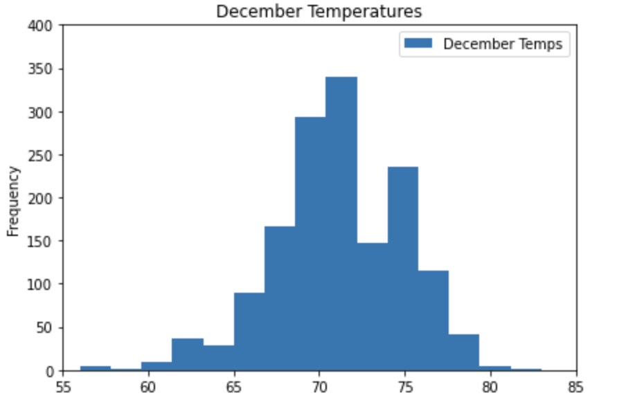

# Surfs_up

## Overview

An investor interested in opening a Surf n' Shake shop in Oahu, Hawaii has asked to analyze the weather conditions inorder to gauge the sales of surfboards and ice creams throughout the year. Below is the detailed list of tasks that need to be done:
- Analyze the precipitation activity in Oahu for one year, during 23 August 2016 through 23 August 2017.
  - Plot the results.
  - Provide descriptive statistics.
- Analyze station information used to collect weather data to gauge data reliability.
  - List all stations and most active station so far.
  - Determine the minimum, maximum and average temperatures for the most active station.
- Analyze temperatures for the most active station.
- Determine temperature data for month of June across all available stations and years.
- Determine temperature statistics for month of December across all available stations and years.

## Resources

- Anaconda3-2022.05
- Conda 4.14.0
- Jupyter Notebook 6.4.8
- ipykernel 6.9.1
- Python 3.7.13
- Pandas 1.3.5
- Matplotlib 3.5.1
- SQLite
- PostgreSQL and pgAdmin
- SQLAlchemy 1.4.32
- Flask 2.2.3

## Results
- Pandas, SQLAlchemy ORM and Matplotlib modules are used extensively to generate the results. 

### Precipitation Analysis:

- During 23 Aug 2016 and 23 Aug 2017, months like April, May, August, September have higher amounts of precipitation than others. 
- Sep 2016 shows the day with highest precipitation of 6.7 inches.
- Precipitation was observed 2021 times in that time period. Looking at the mean precipitation, it can ve concluded that Oahu has many sunny days compared to rainy days.
<table align="center">
<tr>
<td></td>
<td></td>
</tr>
</table>

### Station Information: 

- Among the 9 stations from which precipitation data is being collected, the most active station is WAIHEE 837.5, HI, US. 
- For this station, The results show that the low (minimum) temperature is 54°F, the high (maximum) temperature is 85°F, and the average temperature is approximately 71.7°F. 
- The temperatures from the most active station show that a vast majority of the observations were over 67 degrees.  

<table align="center"><tr><td></td></tr></table>

### Temperature Analysis:

- The month of June has higher mean temperature of 75°F when compared to 71°F in December. With just a difference of 4°F between the two months, little fluctuaton of temperatures is observed.
- The maximum temperatures of 83°F in June and 85°F in December are also remarkably similar.
- The minimum temperature of 56°F in December and 64°F in June show the greatest variance. The lower temperature level in December may not be conducive for surfing or ice cream, however a standard deviation of 3.75 suggests that the temperatures are not widely spread out. 
<table align="center"><tr>
<td></td>
<td></td>
</tr></table>

- It can also be observed that the temperatures recorded in December vary more than those in June. To show the frequency centers around the means, the temperatures of June and December are grouped into 15 bins. With mean at 75°F, June histogram has more data distributed to the left giving it a left tail. We can conclude that this data has slight left skew. With mean of 71°F, December histogram has data almost equally distributed on either side of the curve (normal bell curve distribution). 
<table align="center">
<tr>
<td></td>
<td></td>
</tr>
</table>

## Summary

With the above observtions, it can be concluded that the temperatures in Oahu are relatively the same throughout the year. The surf and ice cream shop business is sustainable year-round with the recorded temperature patterns. Since temperatures alone do not give a whole picture of weather patterns, additional information as specified below should be gathered before proceeding with this venture. 

- Similar to analyzing temperatures for months of June and December, precipitation data can also be compared between the two months to determine rainy weather patterns.
<table align="center">
<tr>
<td></td>
<td></td>
</tr>
</table>

- The temperature and precipitation data from the weather station close to the prospective location of Surf n' Shake can be retrieved for June and December or for all months to determine the patterns in that geography. 
